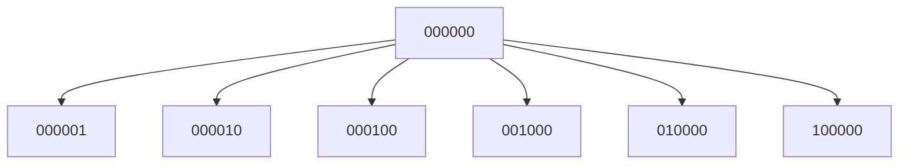

# **SUBIT‑64 Whitepaper — Extended Edition**

Version: 1.1  
Status: Public Release  
Document Type: Extended Technical Whitepaper

---

# **Abstract**

SUBIT‑64 is a universal semantic architecture built on a 6‑dimensional binary axis system, an 8‑layer semantic stack, and a 64‑node hypercubic topology.  
It provides a compact, interpretable, and computationally efficient model for representing meaning, behavior, cognition, and transformation.

This extended whitepaper expands the core document with:

- historical context  
- mathematical derivations  
- design rationale  
- extended diagrams  
- case studies  
- implementation notes  
- cross‑domain applications  
- future directions  

SUBIT‑64 is presented as a **semantic operating system**: a minimal, universal, interpretable engine for modeling meaning.

---

# **1. Introduction**

## **1.1 The Problem Space**

Semantic modeling suffers from three systemic issues:

- **Dimensional inflation** — models with hundreds of latent dimensions  
- **Opacity** — uninterpretable embeddings  
- **Lack of topology** — no structural constraints  
- **Static taxonomies** — no dynamic logic  
- **Domain fragmentation** — separate models for cognition, behavior, society, etc.

SUBIT‑64 solves these by introducing:

- a **minimal axis system** (6 bits)  
- a **strict topology** (6D hypercube)  
- a **semantic stack** (8 layers)  
- a **dynamic engine** (operators, transitions, trajectories)  

The result is a **unified semantic manifold**.

---

# **2. Historical Context**

SUBIT‑64 emerged from three converging traditions:

### **2.1 Structuralism**
Binary oppositions → semantic axes.

### **2.2 Cybernetics**
State machines → node transitions.

### **2.3 Cognitive science**
Layered processing → semantic stack.

SUBIT‑64 synthesizes these into a single architecture.

---

# **3. Mathematical Foundations**

## **3.1 Axis Space**

The axis space is:

```
A = {0,1}^6
```

Dimensionality:

```
dim(A) = 6
|A| = 64
```

## **3.2 Topology**

The topology is the 6D hypercube:

```
Q6 = (V, E)
V = 64 nodes
E = 192 edges
```

Edges defined by:

```
Hamming(a, b) = 1
```

## **3.3 Distance Metric**

Distance:

```
d(a, b) = Hamming(a, b)
```

Properties:

- metric  
- symmetric  
- triangle inequality  
- integer-valued  

## **3.4 Layer Function**

Layer is a mapping:

```
L: V → {0..7}
```

Layer does not modify topology.

---

# **4. Architecture Overview**

SUBIT‑64 consists of:

- **Axis system** — structural basis  
- **Nodes** — atomic semantic states  
- **Stack layers** — vertical semantics  
- **Topology** — adjacency and distance  
- **Operators** — transformations  
- **Transitions** — dynamic logic  
- **Trajectories** — processes  
- **Profiles** — mask/shadow/optimum/pathology  

This forms a **semantic engine**.

---

# **5. Axis System (Extended)**

Axes encode fundamental semantic tensions.

| Axis | 0‑pole | 1‑pole |
|------|--------|--------|
| b1 | Stability | Change |
| b2 | Internal | External |
| b3 | Passive | Active |
| b4 | Singular | Distributed |
| b5 | Concrete | Abstract |
| b6 | Determinate | Indeterminate |

Axes are:

- orthogonal  
- independent  
- generative  
- binary  
- immutable  

---

# **6. Topology (Extended)**

## **6.1 Hypercube Diagram (2D projection)**



*(Only the local neighborhood shown for clarity.)*

## **6.2 Properties**

- no privileged nodes  
- no privileged axes  
- uniform structure  
- distance‑regular  
- bipartite  

---

# **7. Semantic Stack (Extended)**

| Layer | Function | Dynamic Role |
|-------|----------|--------------|
| 1 Matter | physical grounding | stability |
| 2 Organic | adaptive systems | oscillation |
| 3 Dynamics | motion & force | propagation |
| 4 Perception | sensory modulation | diffusion |
| 5 Spectrum | fields & gradients | expansion |
| 6 Psychic | inner modulation | internalization |
| 7 Social | collective systems | amplification |
| 8 Abstract | conceptual structures | synthesis |

Layers form a **vertical semantic ecosystem**.

---

# **8. Node Model (Extended)**

Each node has:

- axis vector  
- layer  
- semantic profile  

Profile fields:

- **mask** — functional expression  
- **shadow** — distortion  
- **optimum** — ideal form  
- **pathology** — destructive extreme  

Nodes are **atomic** and **non‑overlapping**.

---

# **9. Operators (Extended)**

Operators act on:

- nodes  
- axis vectors  
- trajectories  
- clusters  
- layers  

Examples:

- **Flip(i)** — invert axis  
- **Neighbor(i)** — move to adjacent node  
- **Invert()** — antipode  
- **Project(layer)** — vertical mapping  
- **Jump()** — non-local transition  

Operators form a **non‑commutative algebra**.

---

# **10. Transitions (Extended)**

Transitions define dynamic movement.

Types:

- topological  
- axis-based  
- layer-based  
- semantic  
- trajectory-based  
- non-local  

Transitions preserve invariants unless explicitly broken.

---

# **11. Dynamics (Extended)**

## **11.1 Axis Dynamics**
- flips  
- cascades  
- drift  
- oscillation  
- convergence  
- divergence  

## **11.2 Layer Dynamics**
- grounding  
- modulation  
- propagation  
- diffusion  
- expansion  
- internalization  
- amplification  
- synthesis  

## **11.3 Cross-Layer Dynamics**
- upward flow  
- downward flow  
- resonance  
- loops  

---

# **12. Case Studies**

## **12.1 Cognitive Process Example**

Trajectory:

```
Perception → Spectrum → Psychic → Abstract
```

Axis shifts:

- b4: singular → distributed  
- b5: concrete → abstract  
- b6: determinate → indeterminate  

Interpretation:

- sensory input  
- pattern extraction  
- internal modulation  
- conceptual synthesis  

---

## **12.2 Social Dynamics Example**

Trajectory:

```
Dynamics → Social → Abstract
```

Axis shifts:

- b3: active  
- b4: distributed  
- b5: abstract  

Interpretation:

- motion  
- collective amplification  
- conceptual generalization  

---

## **12.3 Behavioral Conflict Example**

Oscillation:

```
xx0xxx ↔ xx1xxx
```

Passive ↔ Active loop.

---

# **13. Implementation Notes**

A compliant implementation must:

- preserve topology  
- preserve axis system  
- implement operators  
- follow transition rules  
- use canonical dictionary format  

Output must be structured and reproducible.

---

# **14. Cross‑Domain Applications**

SUBIT‑64 applies to:

### **14.1 Cognitive science**
- attention  
- emotion  
- reasoning  

### **14.2 Behavioral modeling**
- decision-making  
- conflict resolution  

### **14.3 Social systems**
- group dynamics  
- communication patterns  

### **14.4 Conceptual modeling**
- category formation  
- abstraction  

### **14.5 AI systems**
- interpretable embeddings  
- semantic classifiers  
- reasoning engines  

---

# **15. Future Directions**

SUBIT‑64 can be extended into:

- multi‑layer SUBIT‑256  
- temporal SUBIT‑T models  
- SUBIT‑Graph embeddings  
- SUBIT‑Neural hybrid architectures  
- SUBIT‑Agents for reasoning  

The architecture is modular and scalable.

---

# **16. Conclusion**

SUBIT‑64 is a complete semantic operating system:

- minimal  
- interpretable  
- universal  
- dynamic  
- mathematically grounded  
- operational across domains  

It provides a unified framework for modeling meaning, behavior, and transformation.

---

